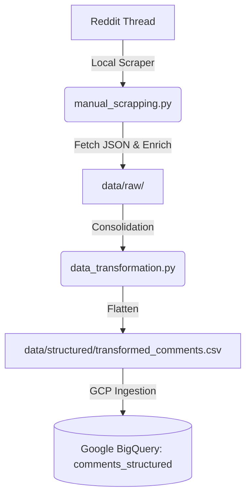

# Reddit Astroturfing NLP Analysis

This project is an end-to-end pipeline designed to scrape, enrich, and ingest Reddit comments to analyze potential astroturfing (coordinated inauthentic behavior) campaigns.

## Architecture & Workflow

Due to Reddit's strict anti-bot measures (403 Forbidden on Datacenter IPs), scraping is performed **locally**. The integrated pipeline then transforms the data and automatically syncs it to Google Cloud BigQuery for future NLP modeling.



### Key Components

1. **Scraper (`src/forensics/manual_scrapping.py`)**: Uses a "Direct JSON Access" method to bypass API limits. It also performs **Author Enrichment**, fetching account age and karma to calculate a customized **Trust Score**.
2. **Transformer (`src/infra/data_transformation.py`)**: Flattens nested Reddit reply trees and applies robust CSV formatting (quoting all fields) to cleanly handle complex, multi-line comment text.
3. **Ingestion Engine (`src/infra/gcp_ingestion.py`)**: Seamlessly connects your local structured data to BigQuery using `google-cloud-bigquery`.

## Setup & Prerequisites

1.  **Environment**: Python 3.11+
2.  **Dependencies**:
    ```bash
    pip install loguru pandas google-cloud-bigquery python-dotenv requests
    ```
3.  **Google Cloud Configuration**:
    Create a `.env` file in the root directory with your GCP details:
    ```env
    GCP_PROJECT_ID=your-gcp-project-id
    GOOGLE_APPLICATION_CREDENTIALS=/path/to/your/service-account.json
    ```

## Usage

### 1. The Integrated Pipeline (Recommended)

To scrape a new thread, enrich the data, update the local master file, and completely sync it to BigQuery in one go:

```powershell
python -m src.forensics.manual_scrapping "https://www.reddit.com/r/mexico/comments/..." --mode master
```
*Note: `--mode master` uses `WRITE_TRUNCATE` in BigQuery, meaning your local `transformed_comments.csv` becomes the absolute source of truth.*

### 2. Standalone Cloud Sync

If you've manually edited the local CSV and just want to push those updates to BigQuery without scraping everything again:

```powershell
python -m src.infra.gcp_ingestion --sync-master
```

### 3. Single Thread Mode (Append)

If you strictly want to append a single thread without rebuilding the entire master dataset:

```powershell
python -m src.forensics.manual_scrapping "https://www.reddit.com/r/mexico/comments/..." --mode single
```

## Next Steps: NLP Phase (Pending)
Phase 2 of this project will involve pulling the raw text data from BigQuery to perform Clustering (e.g., HDBSCAN) and Sentiment Analysis to identify coordinated astroturfing clusters.
