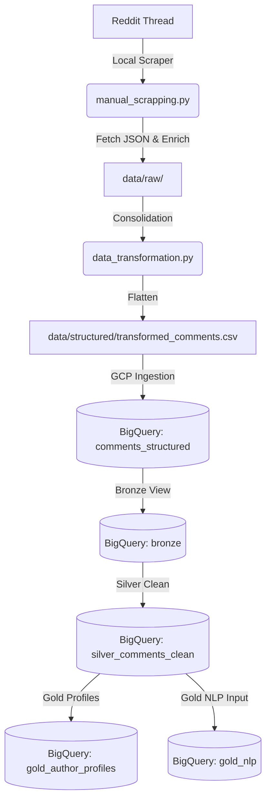

# Reddit Astroturfing NLP Analysis

This project is an end-to-end pipeline designed to scrape, enrich, and ingest Reddit comments to analyze potential astroturfing (coordinated inauthentic behavior) campaigns.

## Architecture & Workflow

Due to Reddit's strict anti-bot measures (403 Forbidden on Datacenter IPs), scraping is performed **locally**. The integrated pipeline then transforms the data and automatically syncs it to Google Cloud BigQuery for future NLP modeling.


```mermaid
graph TD
    A[Reddit Thread] -->|Local Scraper| B(manual_scrapping.py)
    B -->|Fetch JSON & Enrich| C[data/raw/]
    C -->|Consolidation| D(data_transformation.py)
    D -->|Flatten| E[data/structured/transformed_comments.csv]
    E -->|GCP Ingestion| F[(BigQuery: comments_structured)]
    F -->|Bronze View| G[(BigQuery: bronze)]
    G -->|Silver Clean| H[(BigQuery: silver_comments_clean)]
    H -->|Gold Profiles| I[(BigQuery: gold_author_profiles)]
    H -->|Gold NLP Input| J[(BigQuery: gold_nlp)]
```

### Key Components

1. **Scraper (`src/forensics/manual_scrapping.py`)**: Uses a "Direct JSON Access" method to bypass API limits. It also performs **Author Enrichment**, fetching account age and karma to calculate a customized **Trust Score**.
2. **Transformer (`src/infra/data_transformation.py`)**: Flattens nested Reddit reply trees and applies robust CSV formatting (quoting all fields) to cleanly handle complex, multi-line comment text.
3. **Ingestion Engine (`src/infra/gcp_ingestion.py`)**: Seamlessly connects your local structured data to BigQuery using `google-cloud-bigquery`.
4. **GCP Transformations (`src/infra/run_transformations.py`)**: Executes a Medallion Architecture (Bronze -> Silver -> Gold) inside BigQuery directly from the local environment.

## Setup & Prerequisites

1.  **Environment**: Python 3.11+
2.  **Dependencies**:
    ```bash
    pip install loguru pandas google-cloud-bigquery python-dotenv requests
    ```
3.  **Google Cloud Configuration**:
    Create a `.env` file in the root directory with your GCP details:
    ```env
    GCP_PROJECT_ID=your-gcp-project-id
    GOOGLE_APPLICATION_CREDENTIALS=/path/to/your/service-account.json
    ```

## Usage

### 1. The Integrated Pipeline (Recommended)

To scrape a new thread, enrich the data, update the local master file, and completely sync it to BigQuery in one go:

```powershell
python -m src.forensics.manual_scrapping "https://www.reddit.com/r/mexico/comments/..." --mode master
```
*Note: `--mode master` uses `WRITE_TRUNCATE` in BigQuery, meaning your local `transformed_comments.csv` becomes the absolute source of truth.*

### 2. Standalone Cloud Sync

If you've manually edited the local CSV and just want to push those updates to BigQuery without scraping everything again:

```powershell
python -m src.infra.gcp_ingestion --sync-master
```

### 3. Single Thread Mode (Append)

If you strictly want to append a single thread without rebuilding the entire master dataset:

```powershell
python -m src.forensics.manual_scrapping "https://www.reddit.com/r/mexico/comments/..." --mode single
```

### 4. GCP Transformations (Medallion Architecture)

After your raw data is ingested into BigQuery as `comments_structured`, run the transformation pipeline to build the Bronze, Silver, and Gold conceptual layers:

```powershell
python src/infra/run_transformations.py
```
*Alternatively, you can manage and run all 4 steps directly inside `notebook/control_notebook.ipynb`.*

## Data Dictionary
The `transformed_comments.csv` (and resulting `comments_structured` table in BigQuery) has the following schema:

| Column Name | Type | Description |
| :--- | :--- | :--- |
| `submission_id` | `STRING` | The unique Reddit ID for the overall thread. |
| `comment_id` | `STRING` | The unique Reddit ID for the specific comment. |
| `parent_id` | `STRING` | The ID of the comment or submission this comment is replying to (e.g. `t1_...` or `t3_...`). |
| `body` | `STRING` | The actual text content of the comment. |
| `score` | `INTEGER` | The upvotes minus downvotes for the comment. |
| `controversiality` | `INTEGER` | Reddit's flag (0 or 1) indicating if the comment has a large number of both upvotes and downvotes. |
| `created_utc` | `FLOAT` | Unix timestamp of when the comment was created. |
| `trust_score` | `INTEGER` | Custom calculated score (0-100) based on account age and karma. 0 = deleted, 10 = suspicious, 50 = neutral, 100 = established. |
| `author_name` | `STRING` | The Reddit username of the author. If [deleted] account was deleted, removed, or banned at the time of scraping. |
| `author_is_deleted`| `BOOLEAN` | Whether the author's account was deleted, removed, or banned at the time of scraping. |
| `author_created_utc`| `FLOAT` | Unix timestamp of when the author's account was created. If null, account was deleted, removed, or banned at the time of scraping. |
| `author_comment_karma`| `INTEGER` | The total comment karma of the author. If null, account was deleted, removed, or banned at the time of scraping. |
| `author_post_karma`| `INTEGER` | The total post/link karma of the author. If null, account was deleted, removed, or banned at the time of scraping. |
| `author_is_enriched`| `BOOLEAN` | Flag indicating if the scraper successfully fetched full author details. |


## Next Steps: Phase 2 (NLP Analysis)
Data collection and structural transformations (Medallion architecture) are complete. 

The next phase leverages the `gold_nlp` BigQuery table to perform **Clustering (e.g., HDBSCAN)**, **Sentiment Analysis**, and potentially **Topic Modeling**. The goal is to identify coordinated astroturfing clusters and merge these findings back with the original dataset using the `comment_id` primary key for a comprehensive final report.
